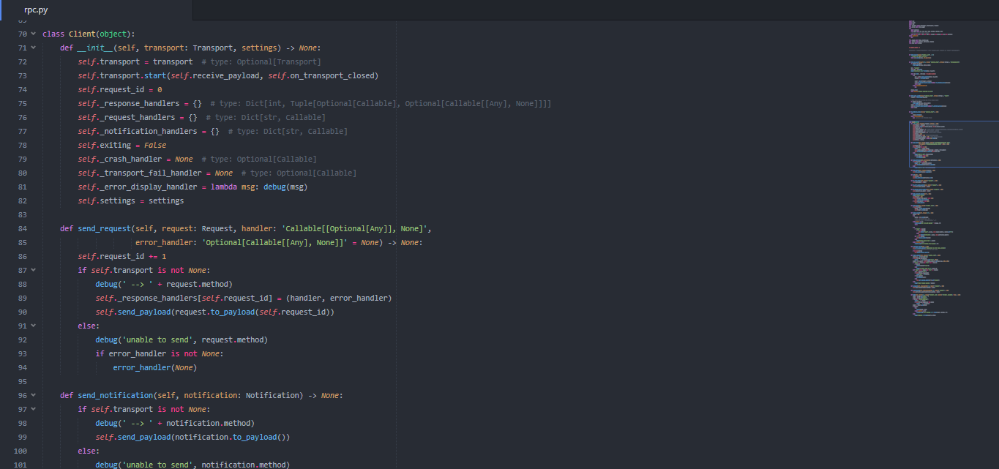
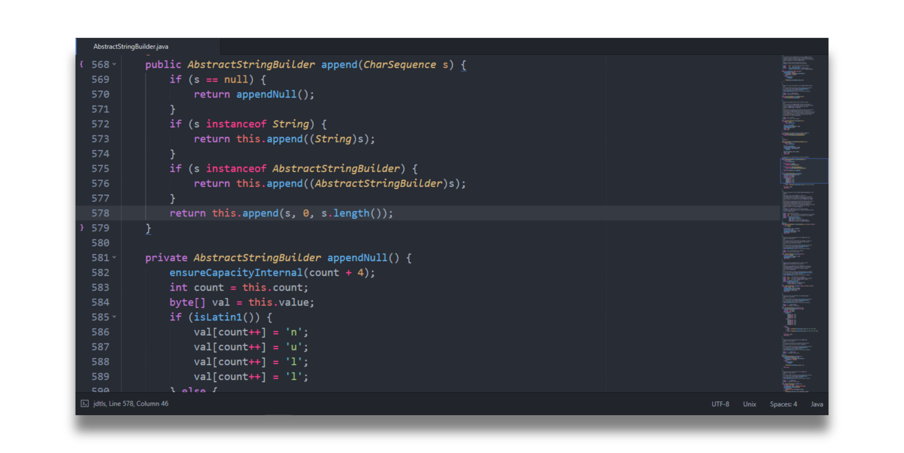
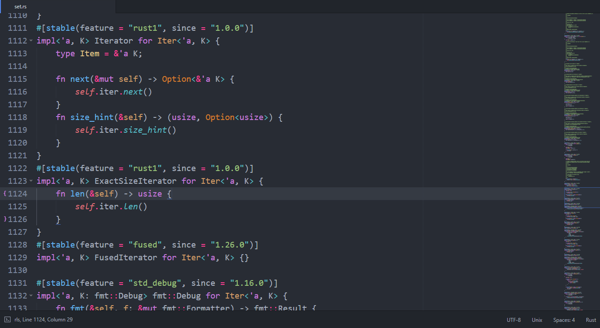
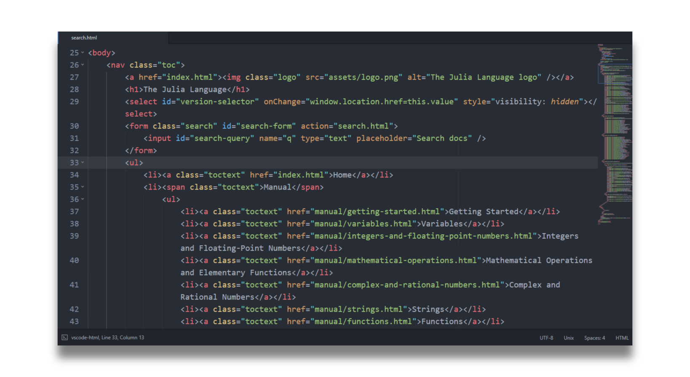
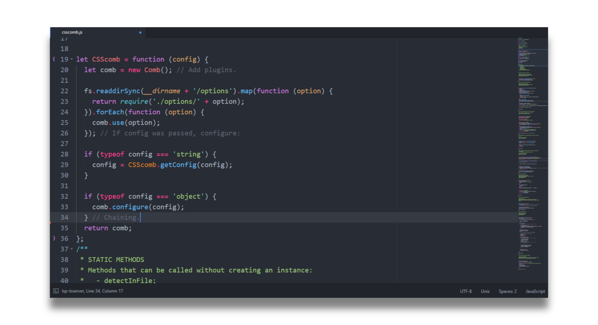
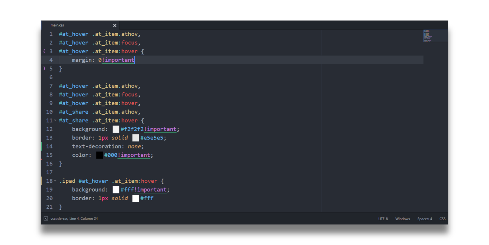

# Dark Knight Color Scheme

🎨 An elegant dark color scheme for Sublime Text.


## Examples

### Python



### Java



### Rust



### HTML



### JavaScript



### CSS



## Installation

1. Bring up the command palette (<kbd>ctrl</kbd>/<kbd>⌘</kbd>+<kbd>shift</kbd>+<kbd>p</kbd>)
2. Select "Package Control: Install Package"
3. Search for "Dark Knight Color Scheme" and hit enter

## Preferences

Paste this into your `Preferences.sublime-settings`

```json
{
    "always_show_minimap_viewport": true,

    "draw_minimap_border": true,

    "draw_white_space": "none",

    "fade_fold_buttons": false,

    "highlight_line": true,

    "highlight_modified_tabs": true,

    "indent_guide_options":
    [
        "draw_active",
        "draw_normal"
    ],

    "line_padding_bottom": 1,

    "line_padding_top": 2,

    "margin": 0,

    "caret_extra_bottom": 1,

	"caret_extra_top": 2,

	"caret_extra_width": 1,

    "overlay_scroll_bars": "enabled",

    "theme": "One Dark.sublime-theme"
}
```

The [One Dark theme](https://packagecontrol.io/packages/Theme%20-%20One%20Dark) is recommended.

## Contributing

If you see something that can be enhanced, please don't hesitate to open an issue or even better, a PR.

## Acknowledgment

Dark Knight color scheme is inspired by atom's iconic One Dark syntax theme.
