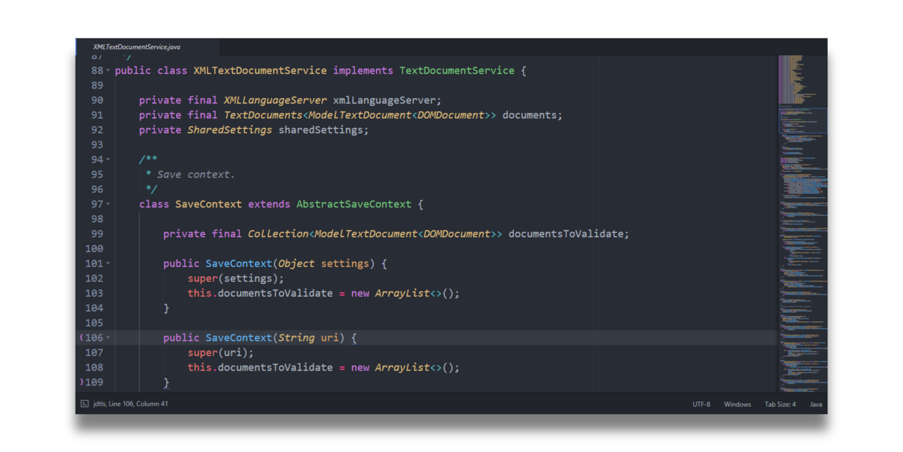

# Dark Knight Color Scheme

🎨 An elegant dark color scheme for Sublime Text 3 .

## Examples

### Python

### Java

### Rust

### HTML

### JavaScript

### CSS

## Installation

1. Bring up the command palette (<kbd>ctrl</kbd>/<kbd>⌘</kbd>+<kbd>shift</kbd>+<kbd>p</kbd>)
2. Select "Package Control: Install Package"
3. Search for "Dark Knight" and hit enter

## Notes

As a personal preference, Dark Knight fits well with the [One Dark theme](https://packagecontrol.io/packages/Theme%20-%20One%20Dark). Otherwise, any dark theme will do it.

## Contributing

If you see something that can be enhanced (probably a lot now!), please don't hesitate to open an issue or even better, a PR.

## Acknowledgment

Dark Knight color scheme is heavily inspired by atom's iconic One Dark syntax theme.
